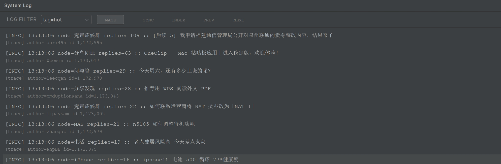

# V2EX LogScope

<!-- Plugin description -->
V2EX LogScope is an IntelliJ IDEA plugin that renders V2EX content in a log-style window so you can stay updated without leaving your IDE.  
V2EX LogScope 是一个 IntelliJ IDEA 插件，通过日志风格的工具窗口在 IDE 内隐蔽浏览 V2EX 话题。

Key Features  
主要特性

- Stealth log-themed UI with MASK toggle  
  隐匿日志风 UI，并提供 MASK 切换
- Browse different nodes (Hot, Tech, Creative, Play, Hot Topics, All)  
  支持热门、技术、创意、好玩、最热、全部等节点切换
- View topic summaries, details and replies with pagination  
  支持话题摘要、详情与回复分页查看
- Proxy configuration and API Token management  
  内置代理与 API Token 配置
- Keyboard-friendly controls and compact layout  
  紧凑布局，交互体验与终端日志接近

Technical Features  
技术特性

- Uses V2EX API v2  
  使用 V2EX API v2
- Supports HTTP/SOCKS proxy  
  支持 HTTP/SOCKS 代理
- Simple layout focused on readability  
  以易读性为优先的简洁布局

<!-- Plugin description end -->

## Installation Requirements

- IntelliJ IDEA 2023.2.3 (build 232.*) — currently the only verified version; newer builds pending validation  
  IntelliJ IDEA 2023.2.3（构建 232.*），暂时唯一实测版本，后续版本待验证
- API Token from the V2EX settings page

## Usage

1. 打开 `Settings -> Tools -> V2EX LogScope` 配置 API Token  
2. 根据需要填写代理信息  
3. 打开底部工具栏中的 `System Log` 工具窗口  
4. 在左侧节点区域选择任意 V2EX 分类  
5. 点击任意日志行即可阅读话题与回复；需要伪装时使用 MASK 切换

## Developer

[@jsnjfz](https://github.com/jsnjfz)

## Acknowledgements

Configuration UI is inspired by [FormatToday/v2-viewer](https://github.com/FormatToday/v2-viewer)  
配置界面参考了 [FormatToday/v2-viewer](https://github.com/FormatToday/v2-viewer)，感谢原作者的优秀实现

## Screenshots

## Repository

[logscope](https://github.com/jsnjfz/logscope)
